<picture>
  <source media="(prefers-color-scheme: dark)" srcset="./dark.svg">
  <source media="(prefers-color-scheme: light)" srcset="./light.svg">
  
</picture>
<div align="center">


<a href="https://git.io/typing-svg">

</a>

<br/>


<br/><br/>

<a href="https://www.linkedin.com/">

</a>

<a href="https://github.com/Ganavi-2006">

</a>

<br/><br/>


</div>

---

# About Me

I am a **B.Tech Artificial Intelligence & Data Science student** with an interest in programming, artificial intelligence, data science, and practical technology projects.

Currently, I am strengthening my foundation in **Python** and exploring data-related technologies through academic learning, certifications, and hands-on projects.

I enjoy learning new technologies, building practical projects, and continuously improving my technical skills.

### Open To

- Technical internships
- Student projects
- Learning opportunities
- Collaborative projects
- Practical technology experiences

---

# Tech Stack

### Languages

<p>

</p>

### Data & Programming

<p>

</p>

### Tools & Platforms

<p>

</p>

---

# AI / ML Expertise

| Domain | Proficiency | Details |
|---|---|---|
| Python | Learning | Programming fundamentals and practical development |
| NumPy | Learning | Numerical computing |
| Pandas | Learning | Data manipulation and analysis |
| Matplotlib | Learning | Data visualization |
| Machine Learning | Learning | Fundamental machine learning concepts |
| Data Preprocessing | Learning | Preparing and transforming datasets |

---

# Featured Projects

<details>
<summary><b>Git Practice</b></summary>

### Git Practice

A practical repository created to learn and strengthen Git and GitHub fundamentals.

| Category | Details |
|---|---|
| **Stack** | Git, GitHub, Python |
| **Scale** | Learning project |
| **Performance** | Focused on understanding version-control workflow |
| **Security** | GitHub repository-based development |
| **Impact** | Strengthened Git and GitHub fundamentals |
| **Repository** | [View Repository](https://github.com/Ganavi-2006/git-practice) |

### What I Practiced

- Git repository creation
- Tracking changes
- Creating commits
- Connecting local repositories with GitHub
- Pushing changes
- Understanding basic GitHub workflow

</details>

---

# Experience

### B.Tech — Artificial Intelligence & Data Science

**Mother Teresa Institute of Engineering and Technology**

Currently pursuing B.Tech in Artificial Intelligence & Data Science.

My academic learning includes programming, databases, data science, machine learning, artificial intelligence, and related technologies.

**Scope of Learning**

- Programming fundamentals
- Python
- Database concepts
- Data science fundamentals
- Machine learning
- Artificial intelligence
- Git and GitHub

**Skills:** `Python` `Git` `GitHub` `AI` `Data Science`

---

# Achievements

<div align="center">

| Recognition | Details |
|---|---|
| Academic Performance | Strong academic performance in B.Tech AI & Data Science |
| AWS Internships | Completed multiple AWS virtual internship cohorts |
| Technical Certifications | Earned certifications through technical learning platforms |

</div>

---

# Certifications

### AWS

- AI In Process Intelligence Virtual Internship
- Cloud Virtual Internship
- Data Engineering Virtual Internship
- Cloud Gen AI Virtual Internship

### HackerRank

- SQL Basics

---

# Coding Profiles

<div align="center">

<a href="https://github.com/Ganavi-2006">

</a>

<a href="https://www.hackerrank.com/">

</a>

</div>

---

# GitHub Analytics

<div align="center">


</div>

<div align="center">


</div>

---

# GitHub Trophies

<div align="center">


</div>

---

# Contribution Activity

<div align="center">


</div>

---

# Contribution Snake

<div align="center">


</div>

---

# Current Focus

```yaml
Learning:
  - Python
  - NumPy
  - Pandas
  - Matplotlib
  - Machine Learning fundamentals
  - Git & GitHub

Building:
  - Python projects
  - GitHub portfolio
  - Practical learning projects

Exploring:
  - Artificial Intelligence
  - Data Science
  - Machine Learning
  - Software technologies

Open To:
  - Internships
  - Student projects
  - Technical collaboration
  - Learning opportunities
